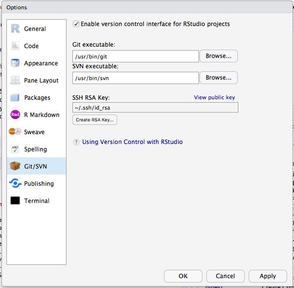
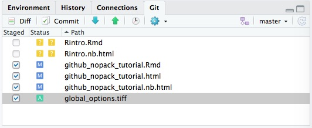
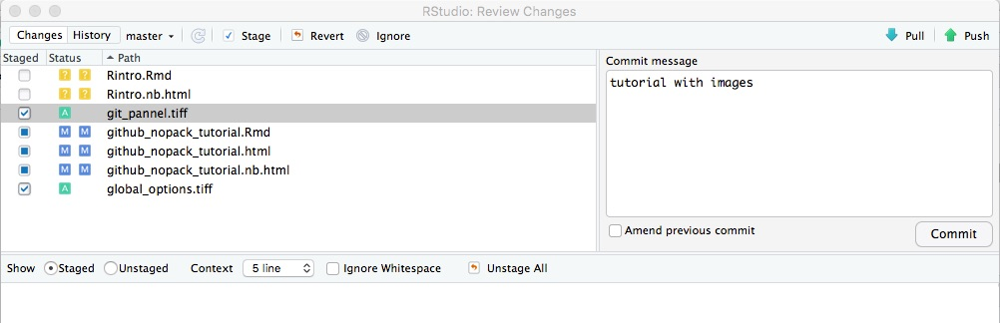
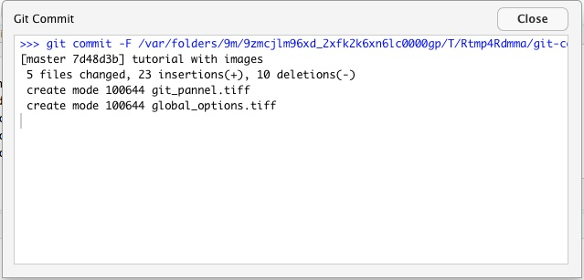

This tutorial explains how to create a GitHub repository in the GamaPintoLab account and link it to a directory in your computer where you edit your R scripts and functions using an RStudio project. 

This will allow you to:

* backup your files in a private repository
* go back to previous versions of your work

# Steps you have to follow once:

1.  create a GitHub account with your fc.ul.pt mail
2.  send your account name and associated email to Francisco so that he can invite you to the GamaPintoLab GitHub organization
3.  install Git on your computer

    + Windows: http://git-scm.com/download/win.
    + OS X: http://git-scm.com/download/mac.
    + Debian/Ubuntu: sudo apt-get install git-core.
    + Other Linux distros: http://git-scm.com/download/linux.
    
4. Tell Git your name and email address. These are used to label each commit so that when you start collaborating with others, it’s clear who made each change. In the shell, run:

```{bash eval=FALSE}
git config --global user.name "YOUR FULL NAME"
git config --global user.email "YOUR EMAIL ADDRESS"
```

5.  Once you've installed Git, you'll need to activate it on your RStudio by following these steps:

    * Go to Global Options (from the Tools menu, Figure 1)
    * Click Git/SVN
    * Click Enable version control interface for RStudio projects
    * If necessary, enter the path for your Git executable where provided.
   
      

6. If needed, generate a SSH key. SSH keys allow you to securely communicate with websites without a password. There are two parts to an SSH key: one public, one private. People with your public key can securely encrypt data that can only be read by someone with your private key. You can check if you already have an SSH key-pair by running:

```{bash eval=FALSE}
file.exists("~/.ssh/id_rsa.pub")
```


7. If that returns FALSE, you’ll need to create a new key. Go to RStudio preferences, choose the Git/SVN panel, and click “Create RSA key…”. Then click “View public key” in RStudio’s Git/SVN preferences pane and copy to clipboard. In GitHub settings create a SSH public key and paste the RSA key content.

# Steps you have to follow each time you create a new repository in a new directory:

1.  Create a new repo on GitHub (+ New repository)
2.  Select GamaPintoLab as the owner
3.  Give it a name and a short description
4.  Select Private
5.  Leave other options as is, then click "Create Repository"
6.  Copy the repository url address (something like: https://github.com/GamaPintoLab/reponame.git)
7.  In RStudio create new project:
    * Execute the New Project command (from the Project menu)
    * Choose "Version Control"
    * Choose "Git"
    * Paste repository url and write directory name and location
    * Tick the "Open in new session" box (optional but useful)
    * Click "Create Project"
8.  Create and edit .R files (or copy them from previous directories)
9.  You can edit the .gitignore file to add files that you don't want to keep in the repository (specially for large data files)
10. Whenever you want to backup your current work:
    1.  in the Git pannel (Figure 2) tick the "Staged" box of the files you have changed
    2.  click "Commit" 
    3.  write commit message (something that helps you know what the changes were about) (Figure 3)
    4.  click "Commit"
    5.  after commit is done close log window (Figure 4)
    6.  click the upward arrow to push the last commit to the GitHub repository (Figure 5)
    
   
  
   

   
    
  

# Steps you have to follow each time you create a new repository in an existing directory:

1.  You may already have a directory with the R scripts and functions associated with a given research project. First, you turn this directory into an R project by choosing New Project > Existing Directory and then select your directory location and click "Create Project"

2.  Go to project options, then to the Git/SVN panel. Change the “Version control system” from “None” to “Git”. You’ll then be prompted to restart RStudio.

3. In a terminal window, change to the project directory and run "git init". Restart RStudio and reopen your package project.

4. Once Git has been initialised, you’ll see two new components in your RStudio project:
    +The git pane, at the top-right, shows you what files have changed and includes buttons for the most important Git commands
    + The git dropdown menu, found in the toolbar, includes Git and GitHub commands that apply to the current file
  
5. The fundamental unit of work in Git is a commit. A commit takes a snapshot of your code at a specified point in time. You create a commit in two stages: 1) You stage files, telling Git which changes should be included in the next commit and 2) you commit the staged files, describing the changes with a message.

6. Select some files to stage and make a first commit

6. Create a new repo on GitHub: https://github.com/new. Select GamaPintoLab as the owner. Give it the same name as your R project directory and write a short description. Select Private (you can change that later) Leave all the other options as is, then click Submit.

7. Open a terminal window, move to the project directory and copy the instructions on github (the option after "... or push an existing repository from the command line:"). It should look like:

```{bash, eval=FALSE}
git remote add origin https://github.com/GamaPintoLab/yourprojectname.git
git push -u origin master
```

8. Improve package code.

9. You can edit the .gitignore file to add files that you don't want to keep in the repository (specially for large data files)

10. Whenever you want to backup your current work:
    1.  in the Git pannel (Figure 2) tick the "Staged" box of the files you have changed
    2.  click "Commit" 
    3.  write commit message (something that helps you know what the changes were about) (Figure 3)
    4.  click "Commit"
    5.  after commit is done close log window (Figure 4)
    6.  click the upward arrow to push the last commit to the GitHub repository (Figure 5) 


    